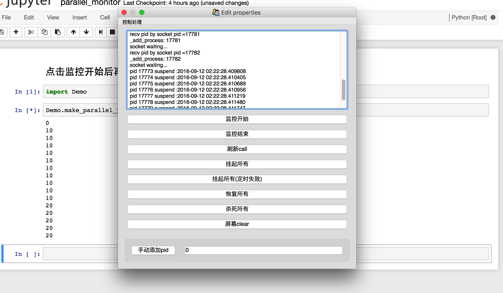
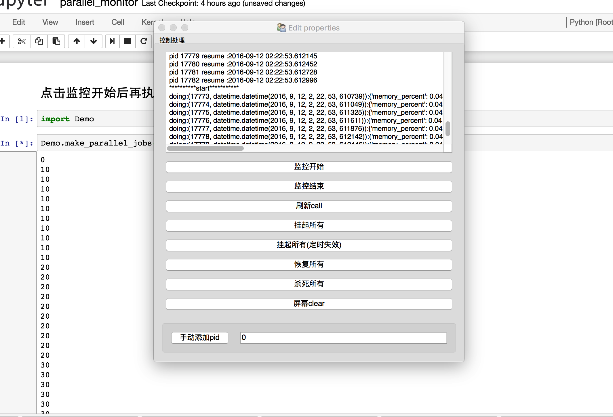

# paraller monitor

＊ 目的解决并行运算长时间任务导致cpu长时间运行的问题，自动没隔一段时间挂起运行的进程，休息一段时间后再此运行

＊ 运行一段时间后，需要使用电脑cpu，可以暂定任务

＊ 父进程已经停止，统一关闭管理所有子进程，kill所有子进程

控制mul process挂起及恢复
避免长时间任务连续占据cpu，通过监控
classmethod add_procee进来的process
运行时间来确保cpu连续长时间稳定运行
ConfigParser+socket方式进程间传递消息，没有
使用Queue、Pipes目的一简单插入成熟模块
目的二适用于各个开源成熟并行框架如parallel等＊＊

